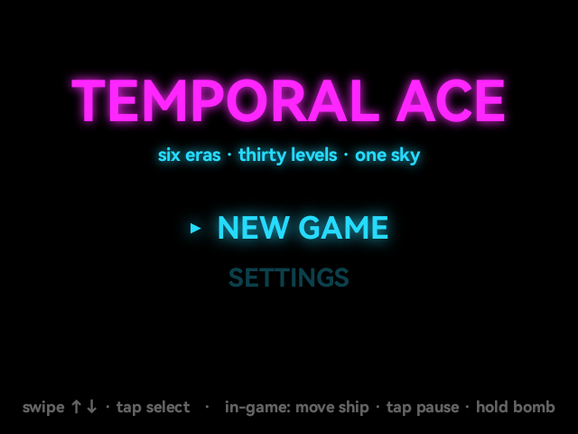
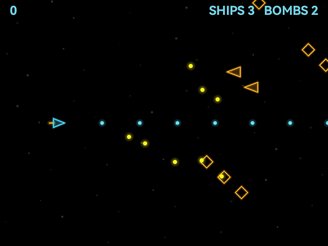

# Temporal Ace

Temporal Ace is a strategy-first shoot-'em-up for the RayNeo X3 Pro AR glasses that carries a single fighter across thirty levels spanning six eras of aviation, from WWI biplanes through the Jet Age and Stealth Era to a far-future neon infinity, with portals marking the jump between eras. The ship autoshoots, so the only input is movement, which puts the game's depth into a large, mutually-exclusive arsenal of powerups: picking up a new weapon replaces the current one, turning every drop into a build decision layered with separate defense and utility upgrades. Each era closes with a boss that has a distinct personality, a scripted phase pattern, and a signature gimmick. A companion web dashboard lets you drag in custom music, voice lines, and art per level and generates ready-made prompts for each.

## Screenshots

  
  

## Controls

- Slide your finger on the right temple pad to move the ship (continuous, the only movement control)
- Tap to pause or confirm a menu selection
- Long-press or double-tap to drop a bomb or go back
- Swipe up/down to navigate menu rows, left/right to adjust settings

## Download

[TemporalAce.apk](TemporalAce.apk)
